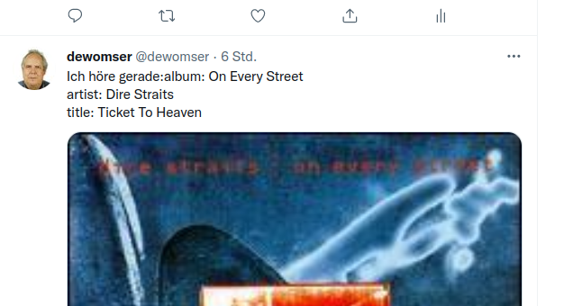

# Tweet_and_toot_music_is_playing
 Shellchecked

2 Shellscripts for Linux/KDE

## toot_music

Pushes Metatags of Audio-Players  VLC or Clementine to your Mastodon account

Needs Linux/KDE with mpris, Bash,Toot

Toot must be authorized at the Mastodon instance

## tweet_music

Pushes Metatags of Audio-Players  VLC or Clementine to your Twitter account

Needs Linux/KDE with mpris, Bash,Twurl

Twurl needs to be be authorized at Twitter

